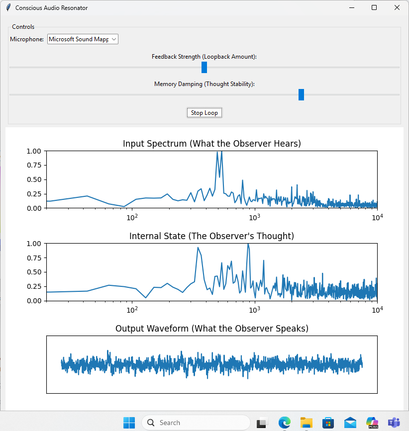

# AI Neuron Audio Processor

A real-time audio processing application that simulates neural-inspired signal processing with memory and feedback loops.
Features

Real-time Audio Processing: Processes microphone input in real-time using frequency domain analysis
Neural-inspired Memory: Implements adaptive memory that learns from audio patterns using Hebbian-like learning
Visual Feedback: Three live plots showing input spectrum, internal processing state, and output waveform
Adjustable Parameters: Control feedback strength and memory stability through intuitive sliders
Loopback Architecture: Creates interesting audio effects through self-referential signal processing

# How It Works

The application implements a simplified artificial neuron that:

Listens: Captures audio input and converts it to frequency domain
Processes: Applies memory-based filtering and adaptive processing
Learns: Reinforces frequently occurring frequency patterns
Outputs: Generates processed audio with configurable feedback mixing

# Installation

Clone or download this repository

Install the required dependencies:

pip install -r requirements.txt

# Run the application:

python aineuron.py

# Requirements

Python 3.7+
PyAudio for real-time audio I/O
NumPy for numerical processing
Matplotlib for real-time visualization
Tkinter for GUI (usually included with Python)

# Usage

Select Microphone: Choose your input device from the dropdown
Adjust Parameters:

# Feedback Strength: Controls how much processed audio is mixed back into the output (0-100%)
Memory Damping: Controls how stable the internal memory patterns are (higher = more stable)

# Start Processing: Click "Start Loop" to begin real-time processing
Monitor Visually: Watch the three plots to see how audio is being processed

# Controls

Feedback Strength: Higher values create more self-referential processing effects
Memory Damping: Controls temporal stability of learned frequency patterns
Start/Stop: Toggle real-time processing on/off

# Technical Details

The system uses:

FFT/IFFT: For frequency domain processing
Adaptive Memory: Tracks and reinforces consistent frequency patterns
Homeostatic Control: Prevents runaway feedback through energy limiting
Thread-safe Architecture: Separates audio processing from GUI updates

# Troubleshooting

No audio devices found: Ensure your microphone is connected and recognized by your system.
Audio dropouts: Try adjusting your system's audio buffer settings or closing other audio applications.
Installation issues: On Windows, you may need to install PyAudio using: pip install pipwin && pipwin install pyaudio
